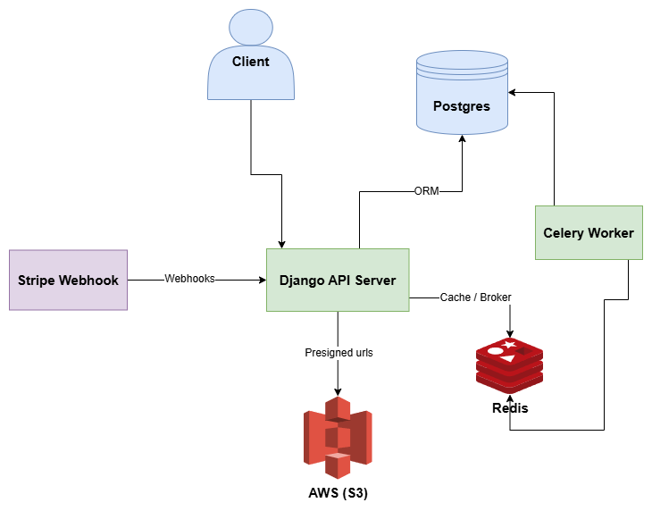

# Aerobox

Aerobox is a Django application powered by Django REST Framework (DRF) that allows users to securely log in and store files in the cloud. It provides robust endpoints for authentication and file management, designed for simplicity and efficiency.

## 🎯 Purpose

This project was built to explore scalable SaaS architecture patterns including:

- Modular app design
- Stripe webhook handling
- Feature-based plan configuration
- S3 storage abstraction
- Background task orchestration

## 🚀 Features

- Secure file uploads to AWS S3 (presigned URLs)
- Folder hierarchy with nested structure
- Share links with expiration and password protection
- Subscription plans with Stripe integration
- Storage limits per plan
- Soft delete & restore functionality
- Role-based feature configuration
- Full test coverage with CI pipeline

## 🏗 Architecture

- **Backend:** Django + Django REST Framework
- **Storage:** AWS S3
- **Background tasks:** Celery + Redis
- **Payments:** Stripe Webhooks
- **Database:** PostgreSQL
- **Testing:** Django TestCase + coverage
- **CI/CD:** GitHub Actions

### 🏗️ Installation

[Check here how to install](https://github.com/amssdias/aerobox/wiki/Installation-&-Setup)
